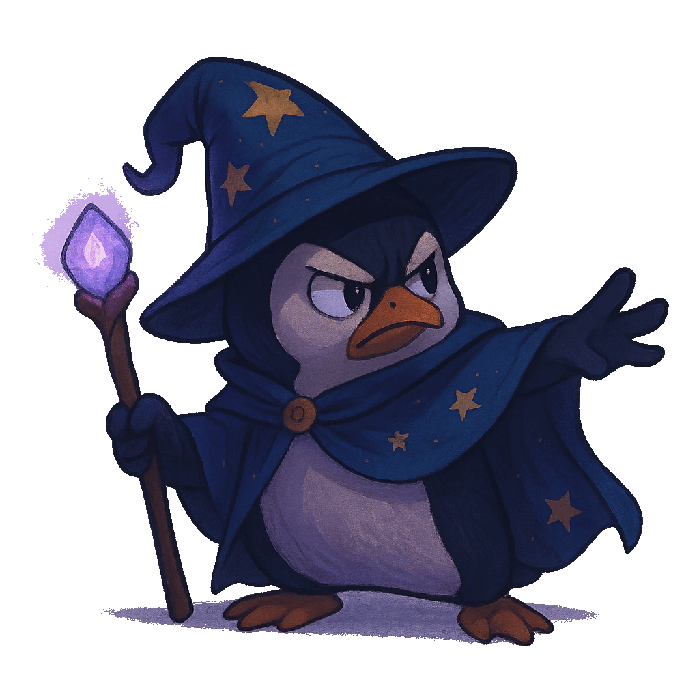

 

    
<h2>  About me </h2>

    
My journey in tech began with a deep, hands-on passion for electronics 🛠️ and hardware programming in C, leading to practical achievements like a 1st Place victory 🏆 in a Line-Following Robot competition.

    
    
This engineering background paved my way into the software realm. Today, I am focused on Web Development 💻, specializing in Back-End Development with C#. I am dedicated to expanding my stack to become a versatile Full-Stack Developer, continuously building projects that solidify my technical expertise.

    
    
A parallel critical interest is Cybersecurity 🔒. I actively engage in security research and practice Penetration Testing methodologies, utilizing tools like Kali Linux and studying hardware vulnerabilities (e.g., BadUSB) to ensure robust and secure systems.

    
    
As a self-motivated and results-driven individual, I possess a strong capacity for rapid learning and thriving on complex challenges. I am currently seeking Internship or Junior Developer/Security Analyst opportunities where I can contribute my unique blend of development and security skills to an innovative team.

    
    
I am eager to connect with industry professionals to discuss projects, future trends, and potential collaborations. Let's build something secure! 🤝

    
    
If I were to introduce one of my projects, I would mention SorenVPN, which is used by over 50,000 people and is active on <a href="https://play.google.com/store/apps/details?id=com.sorenvpnapp.vpnpro">Google Play</a> .

    

 

    
<h2>  Social Media </h2>

    

        
        
        
        
    

 

    
<h2>   Favorite languages and Tools </h2>

    
    

        
        
    

 

    
<h2>   My various diplomas, certificates </h2>

    

        
        
        
        
        
        <a href="https://sorenshamlou.ir/" target="_blank"> </as>
    

 

    
<h2>   Profile Statistics </h2>

    

        
        
        
         
        
<b>Visitors Count</b>
  
        

 
    

 
